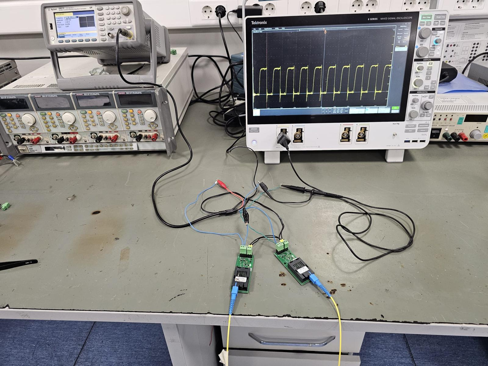
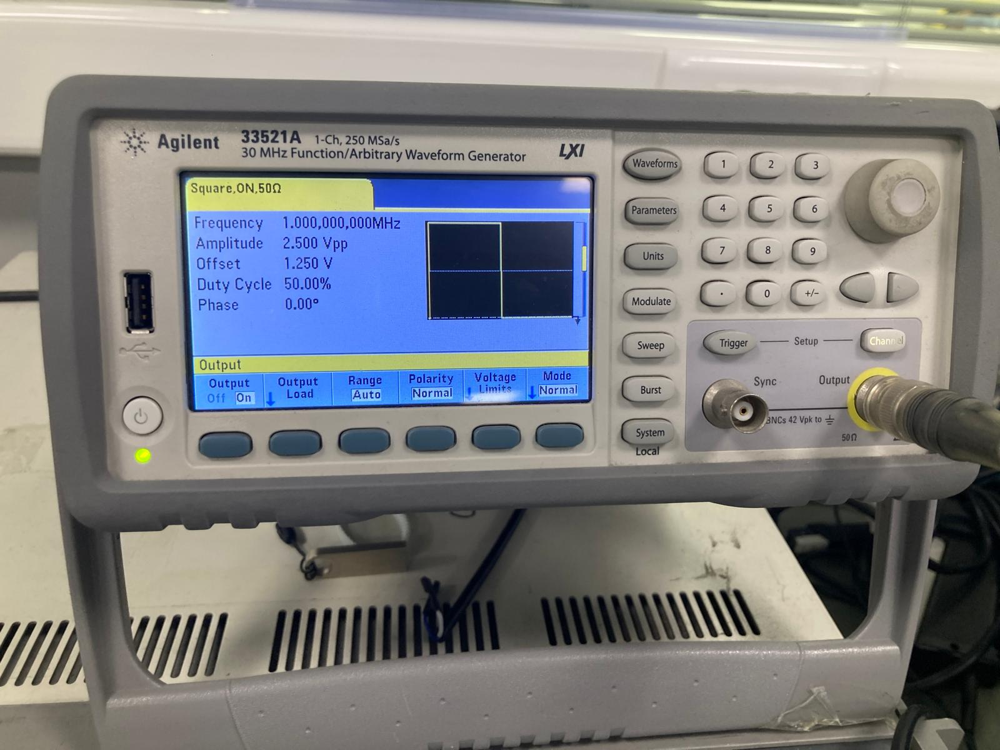
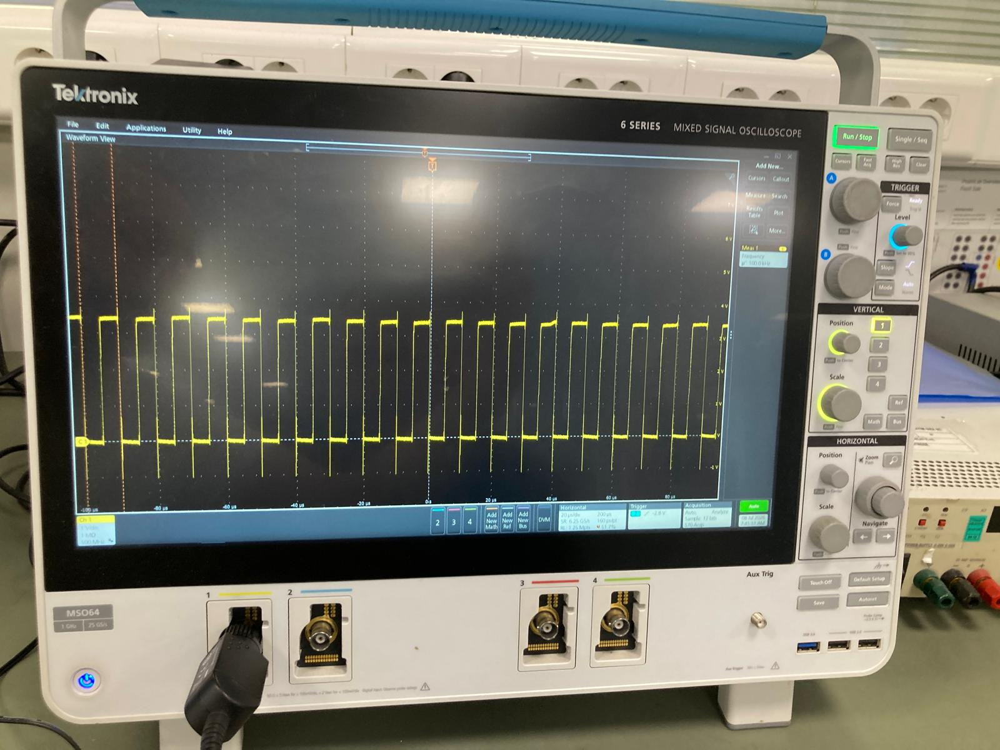
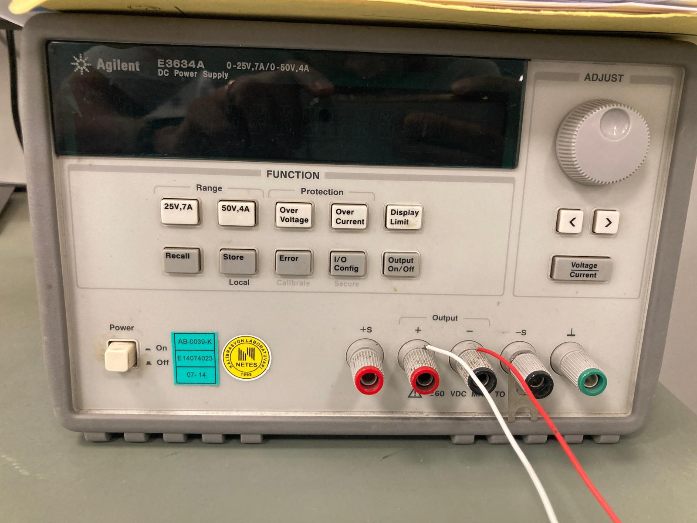

# CAN-Bus-Fiber-Optic-PHY-Analysis

Bu repository, endüstriyel haberleşme arayüzlerinin fiziksel katman (PHY) analizi ve sinyal bütünlüğü (signal integrity) doğrulama süreçlerini, CAN-BUS sinyallerinin fiber optik ortam üzerinden iletimini ve elektro-optik dönüşüm süreçlerinin fiziksel katman (PHY) analizini içermektedir.
Çalışma kapsamında, CAN haberleşme altyapısında kare dalga (square wave) test sinyalleri kullanılarak; sinyal bütünlüğü (signal integrity), yayılım gecikmesi (propagation delay), yükselme/düşme zamanları (rise/fall time) ve hat üzerindeki iletim kayıpları metodolojik olarak analiz edilmiştir.
Endüstriyel ortamlarda karşılaşılan gürültü, iletim kayıpları ve donanım limitlerinin test edilmesine yönelik metodolojik yaklaşımları dökümante eder.
* 

> **Gizlilik Bildirimi:** Bu proje, endüstriyel Ar-Ge süreçlerinde kullanılan test metodolojisini sergilemek amacıyla hazırlanmıştır. Ticari gizlilik (IP) politikaları gereği, kullanılan özel donanım ve kart detayları anonimleştirilmiştir.

---

## 1. Test Düzeneği (Test Setup)
Sistemin fiziksel katman karakterizasyonu için aşağıdaki yüksek hassasiyetli ölçüm ekipmanları kullanılmıştır. Test düzeneğinde sinyal kaynağı ve yükleme birimleri, hattın doğal empedansını ve frekans yanıtını bozmayacak şekilde yapılandırılmıştır.

* **Sinyal Üretimi:** **Agilent 33521A** (30 MHz Waveform Generator) - Yüksek kararlılıkta kare dalga üretimi için yapılandırılmıştır.
** 
* **Sinyal Analizi:** **Tektronix 6 Series MSO** - Sinyal formundaki en küçük distorsiyonları (jitter, ringing, overshoot) yakalamak amacıyla yüksek örnekleme hızında çalıştırılmıştır.
** 
* **Güç Kaynağı:** **Agilent E3634A** (DC Power Supply) - Test süresince voltaj seviyesinin sabitliğini garanti altına almak için kullanılmıştır.
** 

---

## 2. Test Metodolojisi
Frekans tarama (Frequency Sweep) testi ile sistemin veri taşıma kapasitesindeki "yıkılma" (breakdown) noktaları analiz edilmiştir:

* **Sinyal Enjeksiyonu:** Agilent 33521A üzerinden değişken frekanslı kare dalga sinyali, duty cycle %50 olacak şekilde hatta verilmiştir.
* **Sinyal Bütünlüğü İzleme:** Tektronix 6 Series MSO üzerinde, sinyalin yükselme/düşme zamanları (rise/fall time) ve uçlardaki dalgalanmalar (ringing) gözlemlenmiştir.
* **Bant Genişliği Analizi:** Sinyalin "idealleştirilmiş kare formundan" saptığı frekans noktası, sistemin operasyonel limit değeri olarak tanımlanmıştır.

---

## 3. Teknik Analiz ve Gözlemler

### Düşük ve Orta Frekans Aralığı
Testin başlangıç aşamasında, Agilent 33521A üzerinden iletilen sinyallerin Tektronix ekranında oldukça keskin olduğu gözlemlenmiştir. Yükselme zamanı (Rise Time) teorik limitlerin içerisinde kalmış, sinyal hattı boyunca herhangi bir gürültü veya genlik kaybı yaşanmamıştır. Bu aralık, sistemin endüstriyel haberleşme için en stabil olduğu bölgeyi temsil etmektedir.

### Kritik Frekans ve Sinyal Bozulması
Frekans belirli bir eşiğin üzerine çıktığında, iletim hattı üzerindeki kapasitif ve endüktif bileşenler dominant hale gelmiştir. Sinyal kenarlarında "yuvarlanma" (rounding) ve yükselen kenarlarda "overshoot" efektleri belirginleşmiştir.
* 

* **Sinyal Karakteri:** Kare dalga formu, yüksek frekans bileşenlerini kaybettiği için sinüs dalgasına benzer bir yapıya dönüşmeye başlamıştır.
* **Neden-Sonuç İlişkisi:** Bu bozulmalar, donanım üzerindeki iletim yollarının ve pasif bileşenlerin (R, C, L değerleri) yüksek frekanslara karşı oluşturduğu empedans dengesizliğinden kaynaklanmaktadır.

## 4. Sonuç
Yapılan bu derinlemesine analiz neticesinde, fiziksel katmanın **1 MHz** değerine kadar yüksek sadakatli (high-fidelity) veri iletimi sağladığı doğrulanmıştır. 1 MHz frekans değeri, sistemin endüstriyel haberleşme gereksinimlerini güvenle karşıladığı üst limit olarak belirlenmiştir. Bu çalışma, donanımsal tasarımın yüksek frekanslı çalışma karakterini net bir şekilde ortaya koymaktadır.
